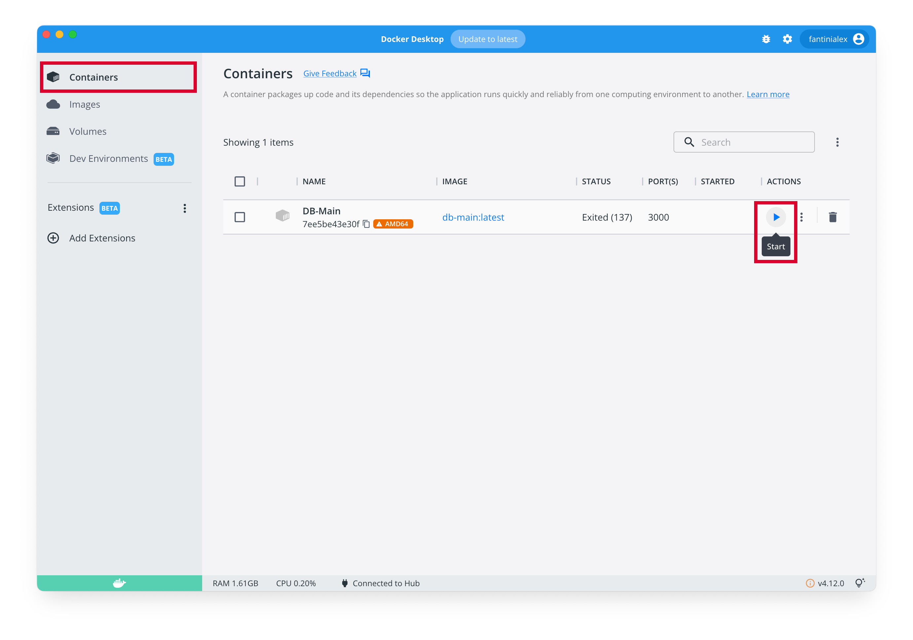
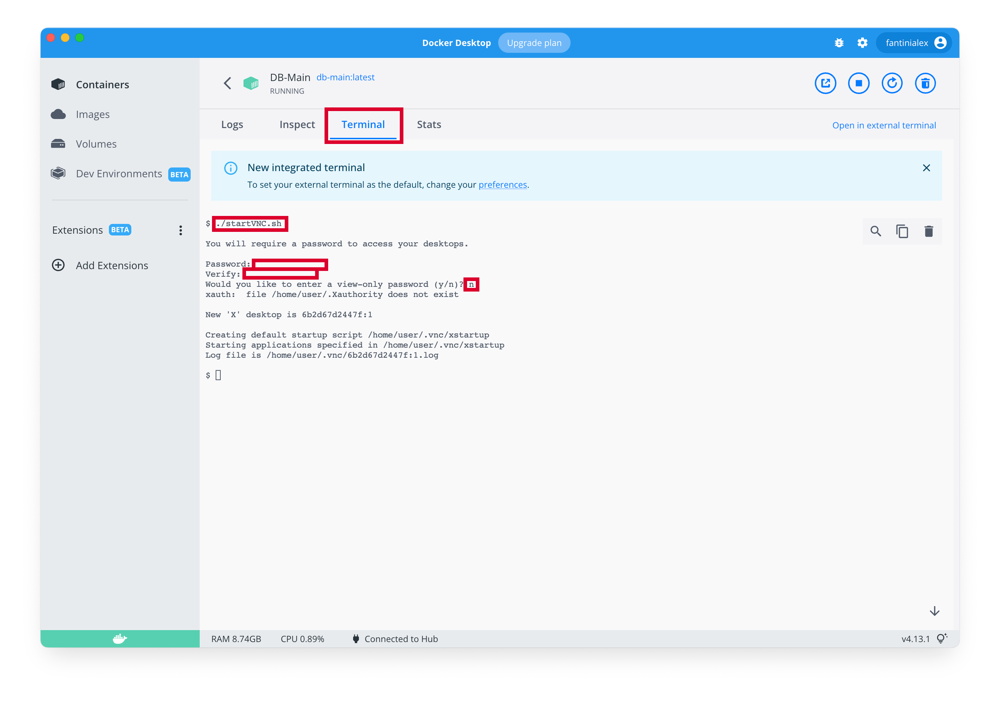
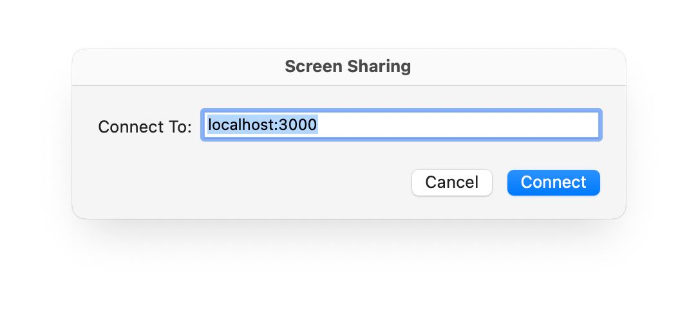
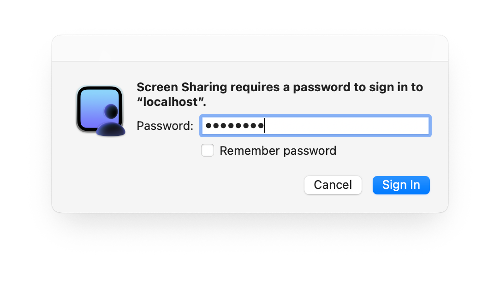
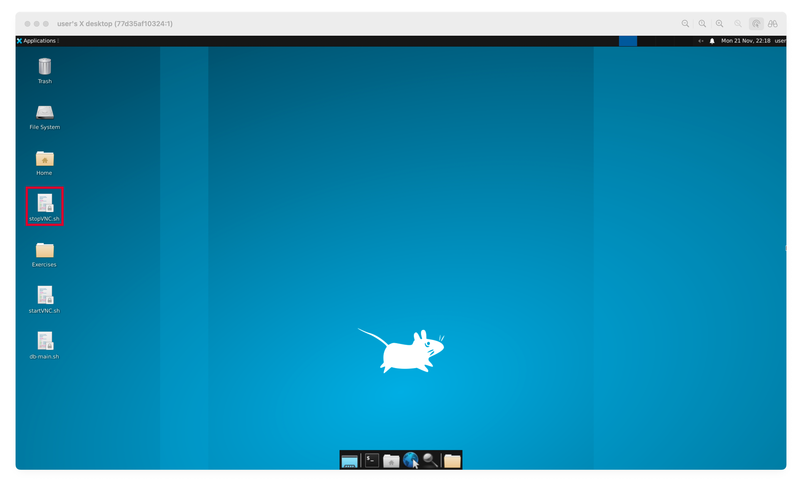
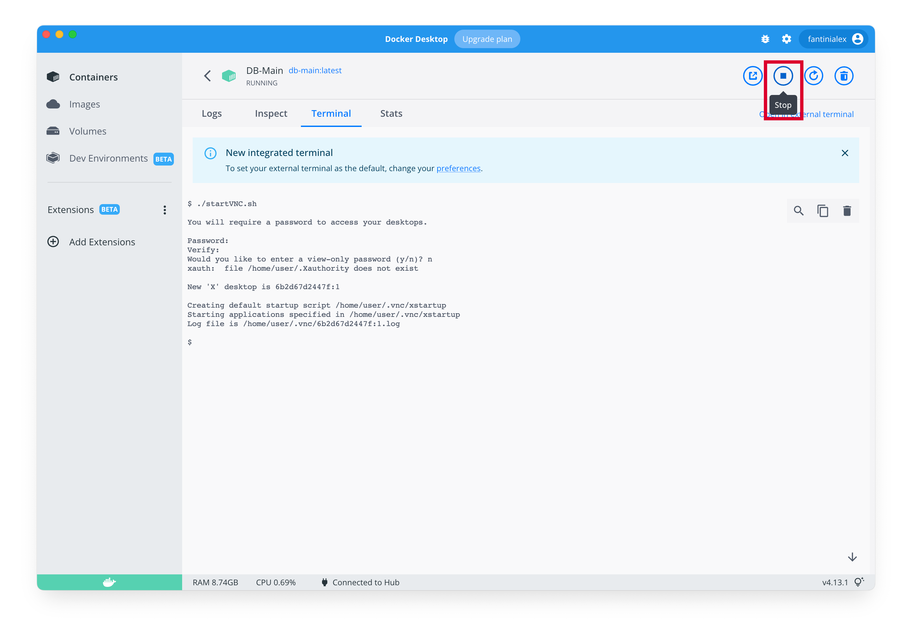

# DB-Main for macOS
A simple Dockerfile to execute [DB-Main](https://www.db-main.eu) on macOS, M1 or Intel

**DISCLAIMER:** The project was developed for personal purposes and later made public in order to distribute it more easily with my fellow students.

## Table of contents
- [Installation](#installation)
- [Start](#start)
- [Stop](#stop)
- [FAQ](#faq)

## Installation
> **Important:** By installing the software you accept its [Terms and Conditions](https://www.db-main.eu/getit/). DB-Main was developed by the University of Namur, for more information visit the [project webpage](https://www.db-main.eu).
1. [Install Docker](https://docs.docker.com/desktop/install/mac-install/)
2. Download this repository (git clone or [download zip](https://github.com/Fantini2002/db-main-for-macOS/archive/refs/heads/master.zip)) and, if necessary, extract it (simply open it)
3. Open folder in Terminal
	> Open *Terminal* (cmd+space > Terminal); type ```cd```, a space and drag the folder onto the terminal; then press *Enter*
3. Build docker image
	(It will take some time... each step is divided into a level for debugging purposes)
	```
	docker buildx build --platform linux/amd64 -t db-main .
	```
4. Create the container
	```
	docker create -t --name DB-Main --platform linux/amd64 -p 3000:5901 -v ~/Desktop/Exercises:/home/user/Desktop/Exercises -e SCREEN_RESOLUTION=1920x1080 db-main
	```
	Available options:
	* ```~/Desktop/Exercises``` replace with the directory that you want to mount into container to easily transfer files (for more information read the [FAQ](#faq) no. 1)
		> Don't know how to write the path name of the folder? (choose one of the following options)
		> * Right click on the chosen folder and, while pressing Alt, select *Copy "[folder name]" as Pathname*
		> * Delete ```~/Desktop/Exercises``` from the command, place the cursor before ```:``` and drag the folder of your choice to the terminal
	* ```1920x1080``` replace with the resolution you prefer, it will be the resolution of the window
5. If you  want, you can delete the folder downloaded in point 2

## Start
1. Start Docker (open the app)
2. Go to *Containers* and, if not running, start the container
	
3. Click on the container's name and go to *Terminal*
4. Type ```./startVNC.sh```, type the password that you prefer twice and then the character ```n```
	
5. Open *Screen Sharing* on your Mac (cmd+space > Screen Sharing)
	> If you cannot find the application visit ```vnc://localhost:3000``` from browser, this will automatically open the connection... make a note of the name of the app for future reuse
6. Type ```localhost:3000```, click *Connect*, type the password that you chose in point 4 and click *Sign In*
	
	
7. You can put full screen the new window and... that's it
	On the Desktop you have the folder *Exercises* and the file *db-main.sh*, double click on it to start DB-Main!
	
	During execution, you must keep Docker open

## Stop
1. Close the programme from the X in the top right-hand corner
2. From Desktop, double click on *stopVNC.sh*
	
2. Close Screen Sharing (it's normal to see *Reconnecting...*)
3. Go to Docker and click *Stop*
	
4. To completely stop Docker, go to the Menu Bar (where there is the Apple logo), click *Docker Desktop* and then *Quit Docker Desktop*

## FAQ
### 1. How does the *Exercises* folder work?
This folder is the only way to transfer files between the Mac and the operating system under DB-Main (the container) and vice versa.  
It is also the only "safe" folder in which to save files, which means that if for some reason you have to recreate the container (e.g. for an update or some problem) all other folders will be permanently deleted... this is because the files are actually saved on your computer.  
The advice is to save everything you create with DB-Main (.lun, .sql, etc.) in it to store it safely and to be able to see and edit it easily from macOS (e.g. sql transformations).
### 2. When I try to save a file I get an error, what should I do?
You are probably trying to save the file in a folder where you do not have permissions to do so, the advice is to save all projects in the *Exercises* folder on your desktop (for more information read FAQ no. 1)