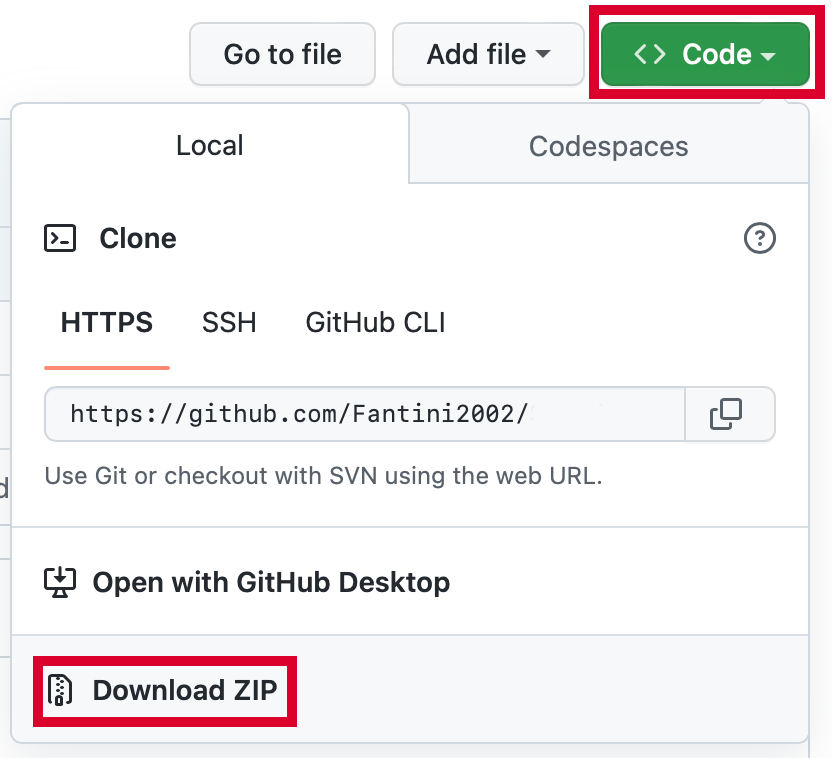
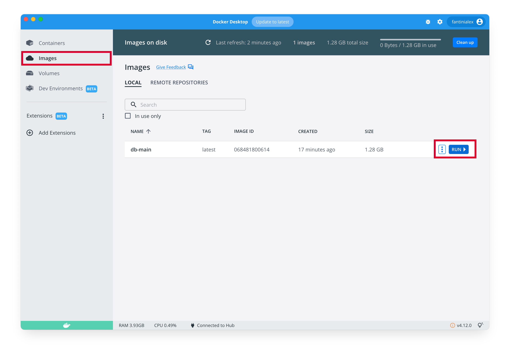
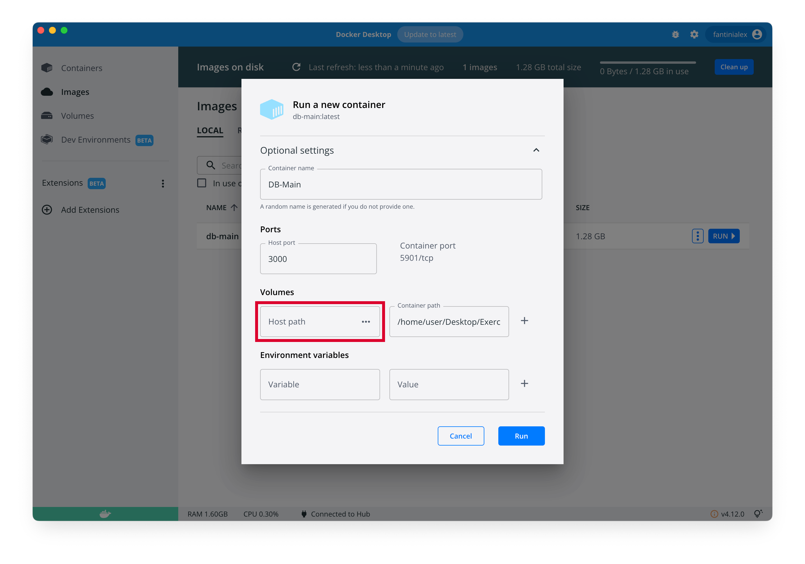
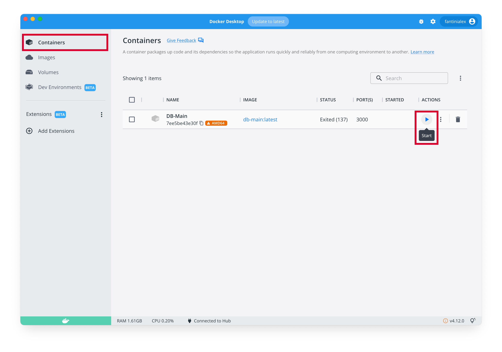
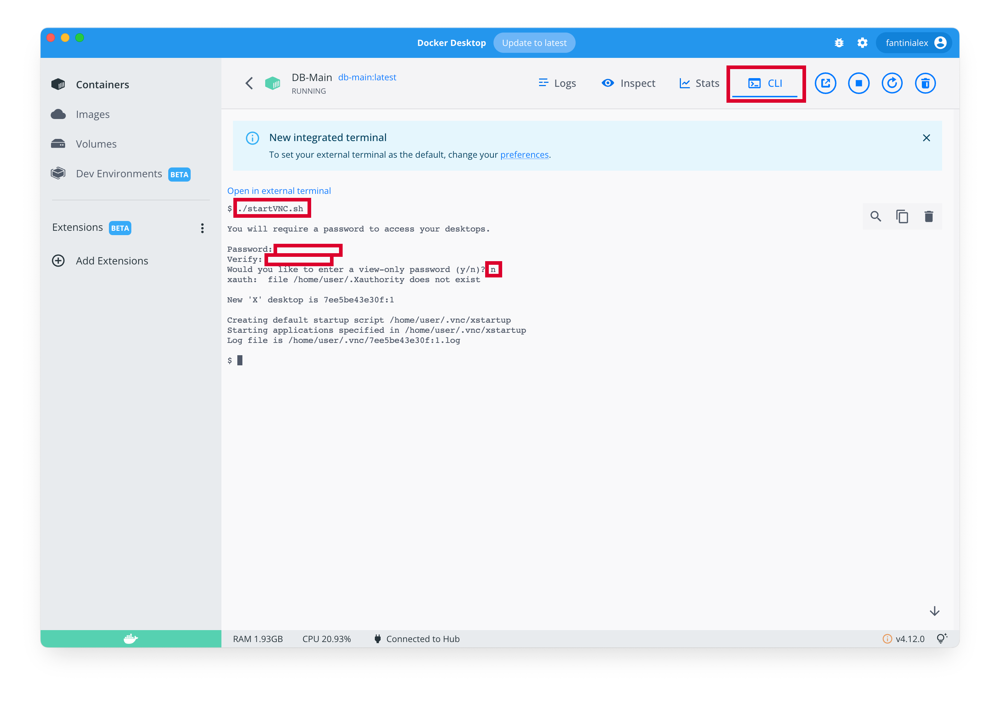
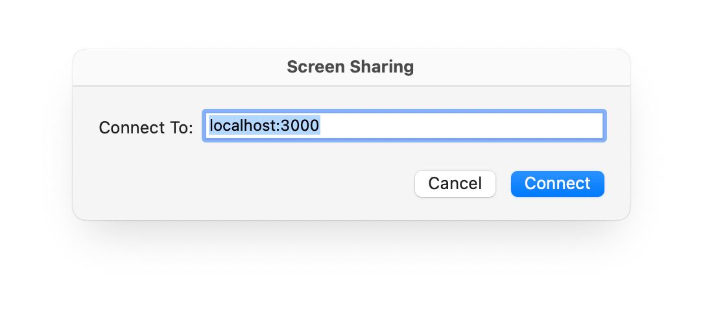
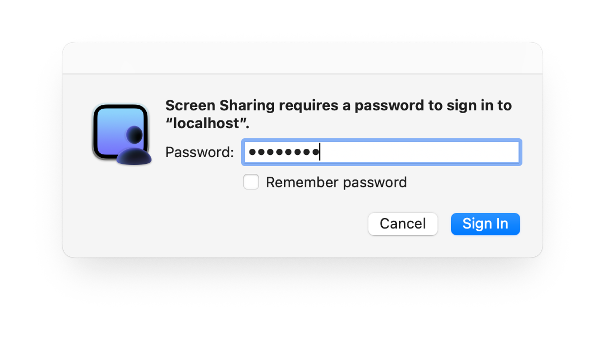
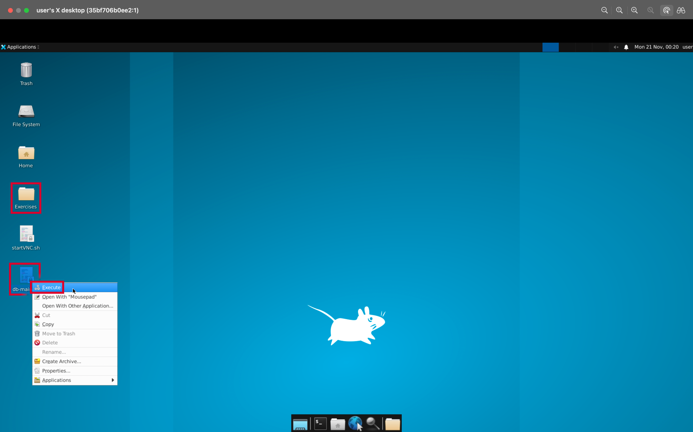
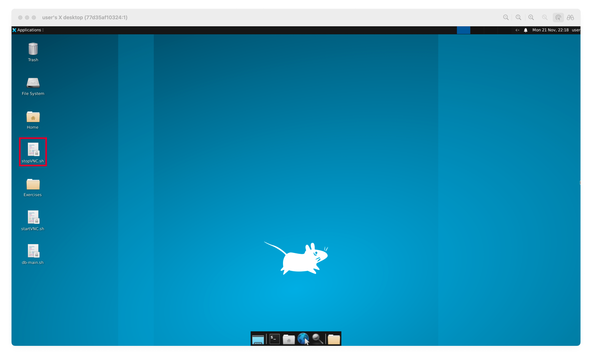

# DB-Main for macOS
A simple Dockerfile to execute [DB-Main](https://www.db-main.eu) on macOS, M1 or Intel

**DISCLAIMER:** The project was realised for personal purposes and later made public in order to distribute it more easily with my fellow students.

## Installation
1. [Install Docker](https://docs.docker.com/desktop/install/mac-install/)
2. Download this repository (git clone or download zip) and, if necessary, extract it (simply open it)
	
3. Open folder in Terminal
	> Open *Terminal* (cmd+space > Terminal); type ```cd```, a space and drag the folder onto the terminal; then press *Enter*
3. Build docker image
	(It will take some time... each step is divided into a level for debugging purposes)
	```
	docker buildx build --platform linux/amd64 -t db-main .
	```
4. Create the container
	* via Terminal
		```
		docker create -t --name DB-Main --platform linux/amd64 -p 3000:5901 -v ~/Desktop/Exercises:/home/user/Desktop/Exercises db-main
		```
		Instead of ```~/Desktop/Exercises``` put the directory that you want to mount into container to easily transfer files
	* via GUI
		1. Open Docker Dashboard, go to *Images* tab and click *Run* next to "db-main"
		
		2. In the pop-up, open *Optional settings* and write the following information
			- Container name: DB-Main
			- Port > Host port: 3000
			- Volumes > Host path: the folder you prefer to easily transfer files (the three dots open a Finder windows to easily select the folder)
			- Volumes > Container path: /home/user/Desktop/Exercises
			
		3. Click *Run*
5. If you  want, you can delete the folder downloaded in point 2

## Start
1. Start Docker (open the app)
2. Go to *Containers* and, if not running, start the container
	
3. Click on the container's name and go to *Terminal*
4. Type ```./startVNC.sh```, type the password that you prefer twice and then the character ```n```
	
5. Open *Screen Sharing* on your Mac (cmd+space > Screen Sharing)
6. Type ```localhost:3000```, click *Connect*, type the password that you chose in point 4 and click *Sign In*
	
	
7. You can put full screen the new window and... that's it
	On the Desktop you have the folder *Exercises* and the file *db-main.sh*, right click on it and *Execute*!
	
	During execution, you must keep Docker open

## Stop
1. Close the programme from the X in the top right-hand corner
2. Close Screen Sharing
3. Go to Docker and click *Stop*
	
4. To completely stop Docker, go to the Menu Bar (where there is the Apple logo), click *Docker Desktop* and then *Quit Docker Desktop*